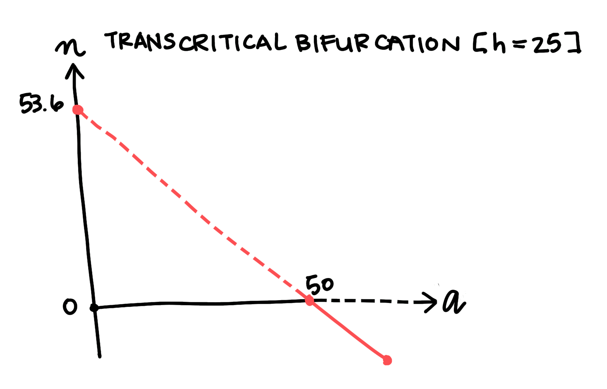

# Stability Analysis Part 2: Bifurcations

In the previous section, we explored a simplified model of fishery dynamics. In this section, we'll explore a more complex model that includes the pressure of active fishing, and see how it responds to changes in the system's parameters. What happens to the fixed points' stability and location? What do the changes say about the system's overall robustness?

## A correction to the logistic model

We can generate an extremely simple fishery model with a single adjustment to the logistic model we used before:

$$\dot{n}=rn\cdot(1-n/K)-h$$ (1)

The new parameter $h>0$ represents a flat fishing quota. The fisherfolk that depend on the redfish population set out to catch the same number of fish every day, regardless of the number of fish remaining in the stock. Equation 1 assumes that the fisherfolk always succeed in meeting their quota. However, we can intuit how that simplification isn't true to life. As the redfish stock depletes, catching redfish becomes increasingly difficult, to the point that we might expect fisherfolk to fail to meet their quota. We correct for this negative feedback by using Equation 2:

$$\dot{n}=rn\cdot(1-n/K)-\frac{hn}{A+n}$$ (2)

We might call $\frac{hn}{A+n}$ an inverted **saturation** term. It represents the number of fish that the fisherfolk actually collect. As $n$ decreases, the saturation parameter $A$ dominates the term's denominator, decreasing the magnitude of its contribution.

```python
# Constants
r = 0.5 # intrinsic growth rate
K = 800 # carrying capacity
h = 50 # fishing quota
A = 30 # saturation term / catch difficulty

# Saturation Demo
def saturation(n):
    return h*n/(A+n)
```

<center>
### Graph 1: Demonstration of the saturation term
<sub><sup>*Fig 1: A demonstration of the saturation term. The value of the term represents the number of fish our modelled fisherfolk succesfully catch. That yield is plotted here for each value of n, with their intended catch h marked by the red dotted line. As n decreases, the yield falls farther and farther short of h.</sub></sup>
</center>

Equation 2 also has the benefit of preserving the fixed point at $n=0$ (try plugging $n-0$ into Equation 1. Try again for Equation 2). With the presence of $n$ in the saturation term's numerator, we expect Equation 2 to have an additional zero in comparison to the simpler logistic equation we explored last chapter. And, as we established last chapter, we can expect the additional fixed point to generate qualitatively different system behavior than what we saw before.

## Critical parameter thresholds and bifurcations

```python
# Constants
r = 0.5 # intrinsic growth rate
K = 800 # carrying capacity
h = fishing.value
A = 16

# Plot fishery phase portrait (with saturation term)

def fishery_model(n):
    return r*n*(1-(n/K))-h*n/(A+n)

pops = np.linspace(0., (5*K)/4, num = 3*K)

# zeros calculated in wolfram alpha
zeros = [0]
fold = (A+K)**2 - 4*h*K/r
# cut out zeros that aren't real
if fold > 0:
    zeros.append(0.5 * (K - A - math.sqrt(fold)))
    zeros.append(0.5 * (K - A + math.sqrt(fold)))
elif fold == 0:
    zeros.append(K - A)
```
<center>
### Graph 2: Phase diagram for the fishery model with saturation. Slider for h
<sub><sup>Fig 2: Phase diagram for our simple fishery model. r = 0.5; K = 800; A = 16; h varies. When h is greater than 10 and less than 100, we see three positive stationary points. As h increases, the range from which the system will return to its non-zero stable stock size narrows. At h = 104, the system reaches a critical threshold, and the two positive stationary points become one. When h is greater than its critical value, the positive fixed points vanish. We call this a fold bifurcation.</sup></sub>
</center>

Our expectation is corroborated. Take some time to experiment with different values of $h$ using the slider provided. You can clearly see the three fixed points in their full glory when $10<h<100$. We mark a stable fixed point at $n=0$ ($n_{0}$), a stable point near $n=K$ ($n_{2}$), and an unstable point between them ($n_{1}$). 

$n_{1}$'s instability means that it acts as a kind of point of no return for the stock's depletion. For any value of $n>n_{1}$, the stock will tend to self-correct toward $n_{2}$. However, as soon as $n$ falls below $n_{1}$, the stock size will plummet to $0$. The pressure applied by fishing activity decreases the system's robustness by narrowing the range from which the system can return to its non-zero stable point. Intuitively, we might predict that increasing that pressure (by increasing the value of $h$) would narrow the range further, making the system even more fragile.

In fact, as $h$ increases, $n_{1}$ and $n_{2}$ do approach each other. When $h$ reaches a certain critical threshold, which we label $h_{c}$, the stable point and the unstable point mutually annihilate. $n_{0}$ is the only fixed point that remains. The stock will tend to deplete completely from any value of $n$: the fishing pressure is so intense that the system has no choice but to collapse. A continuous change in the value of a system parameter has caused a major, sudden shift in the system's qualitative structure. We call this event a **bifurcation**.

(You may also notice that $n_{1}$ appears to vanish when $h<8$. That's an example of a different category of bifurcation, which we'll cover later in the chapter.)

Just as we can gain insight into a system's behavior by identifying the position and behavior of its stationary points, we can gain insight into the nature of a bifurcation by mapping its effect on those stationary points. We map that effect on what's called a **bifurcation diagram**.

## Mutual annihilation: the Fold Bifurcation

<center>

<sub><sup>Fig 3: Bifurcation diagram for a fold bifurcation. The position of each fixed point plotted for each value of h. Solid lines mark stable points, dashed lines mark unstable points. h is plotted horizontally because we treat the parameter as an independent variable when considering bifurcations. This bifurcation category is named after the characteristic fold shape traced by the fixed points. There is also another bifurcation where the unstable point crosses n = 0.</sup></sub>
</center>

We plot the position of the system's fixed points at each value of $h$. Solid lines mark the stable points, and dashed lines mark unstable points. This acts as shorthand for the information we'd get by plotting a phase diagram for every value of $h$: the lines won't tell us the precise rate of change, but it tells us the direction of change. We know that the system state will always flow away from dashed lines and toward solid lines, and so we can intuit the structure. In this case, we can see the range of safety, and how it narrows with increasing $h$ until it disappears.

This category of bifurcation, in which one stable point and one unstable point annihilate each other upon collision, can be identified by the characteristic fold shape you can see in the diagram above. For that reason, mathematicians call this a **fold bifurcation**.

Now, even working with a modestly complex system like this one, one might expect to find more critical parameter thresholds and more sudden shifts in system topology to match. In fact, for this system in particular, we know that reducing $h$ to $0$ would see the system structure revert to the shape of the basic logistic system. This is a fact that we know intuitively, that we can discover from examination of Equation 2, and that we can learn by sufficiently reducing $h$ with the slider above (as I mentioned parenthetically).

This is not a fold bifurcation. In order to re-establish the full range of stability between $n=0$ and $n=K$, $n_{1}$ must abandon its position between $n_{0}$ and $n_{2}$, which it accomplishes by moving toward and past $n=0$. $n_{1}$ represents the stock size at which the fish population's birth rate struggles to balance the sum of its natural death rate and the rate of removal via fishing activity. As the pressure of fishing activity eases, it becomes possible for the birth rate to balance the removal rates at lower population sizes. 

Remember, though, that $h$ only represents the number of fish that the fisherfolk *set out* to catch. We'd also expect lower stock sizes to be able to sustain net population growth if it were more difficult for fisherfolk to successfully meet their quota. We can simulate this dynamic by modifying the parameter $A$.

## Trading stabilities: the Transcritical Bifurcation

Just put in like 3 subplots. The python above graph 2 is sufficient
<center>
### Graph 4: Phase diagram, slider for A
<sub><sup>Fig 4: Phase diagram for the fishery model. r = 0.5; K = 800; h = 25; A varies. Increasing A decreases the position of the lower non-zero fixed point. After the critical threshold at A = 50, that fixed point trades stabilities with the stationary point at n = 0, becoming stable and disappearing into negative values of n.</sup></sub>
</center>

As noted in the description of Equation 2, fisherfolk will find it more difficult to catch fish as the stock depletes. There are factors that can make this effect more or less severe: the size of the environment, for example, or the efficiency of the technology that the fisherfolk use to locate members of the stock. $A$ will be smaller for system arrangements that make it comparatively easier to fish from small stocks (smaller environments, more efficient tech), and larger for arrangements that make meeting quota especially difficult (larger environments, less efficient tech). 

As we increase $A$, $n_{1}$ approaches $n=0$, following the logic detailed above. At the critical threshold $A_{c}$, $n_{1}=n_{0}$. For $A>A_{c}$, $n<0$.

Negative values of $n$ have no physical meaning. To say that $n_{1}$ is negative is simply a mathematically convenient way to say that there is no longer a fixed point interrupting the range of "safe" stock sizes (from which the system will return to $n=n_{2}$). This mathematical abstraction also gives the bifurcation diagram a convenient shape.

### Graph 5: Transcritical bifurcation

<sub><sup>Fig 5: Bifurcation diagram for a transcritical bifurcation. The most positive fixed point isn't pictured because it is well above the bounds of the axis.</sup></sub>

Notice how $n_{1}$ and $n_{0}$ switch stabilities after they cross paths, $n_{0}$ becoming unstable for $A>A_{c}$. This is important because $n_{0}$'s instability means that the system state will tend toward $n=n_{2}$ for any positive value of $n$, as we'd hope and expect. The switch in stability is also important because it is the characteristic feature of a **transcritical bifurcation**.

## Conclusion

We've examined two bifurcations in a modified logistic model, using two system parameters. A more advanced treatment would explore the parameters' interactions with each other, using a multidimensional **parameter space** to visualize the system structure at all combinations of $A$ and $h$. This beginner's foray into stability analysis and bifurcation theory, however, ends here. 

Enjoy your trajectory through phase space, pick your parameter values carefully, and be sure not to fish your stocks to death.