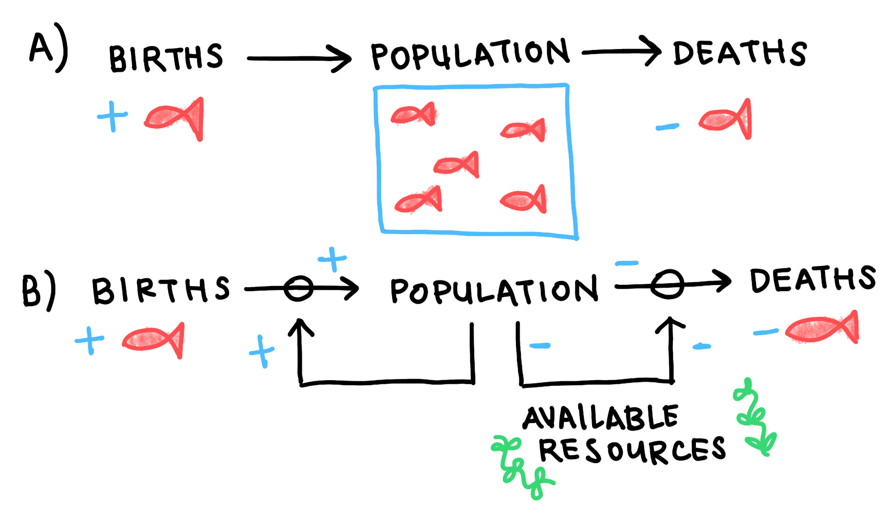
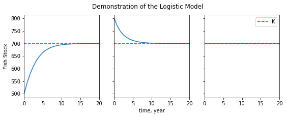
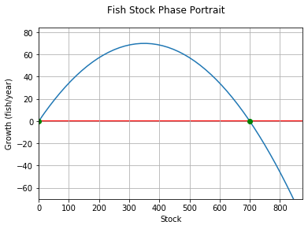

# Equilibrium Analysis

In the previous section, we explored an analytical approach to differential equations. The analytical approach is a powerful way to predict a system's future states when you have a set of initial conditions to start with, but it's less useful when you need an overview of a system's overall dynamics. In this section, we'll explore one system's **equilibrium states**, and demonstrate a method that can tell us which (if any) of these equilibrium states our system will tend to approach from *any* set of inital values.

One area where this approach is especially useful is that of fishery management.

## A very simple fishery model

We'll focus on the population of one fish species in a limited environment. Let's say we're studying redfish in a lake. We want a differential equation that can describe the dynamics of our redfish population. To get there, we'll need to map out the **feedback loops** that dominate those dynamics.

<center>



<sub><sup>Fig 1: Causal loop diagram for our redfish stock. a) The stock is fed by flows in (birth) and flows out (deaths). b) In the absence of fishing pressure or natural predators, the birth rate is proportional to the stock size, and the death rate is dominated by intra-species competition for the lake's limited resources.</sup></sub>
</center>

This is a **causal loop diagram**. We use it to track the **stocks** (boxes) and **flows** (arrows) that make up a system's state. Generally, stocks can be thought of as quantities or reservoirs, while flows can be thought of as processes. Stocks fill or drain through the effects of flows. When flows are affected in turn by the values of stocks, we say that there is a feedback.

In our simplified model, we've assumed that our redfish don't need to worry about any predatory or competitive species in their lake, that no new members will enter from outside the lake, and that the lake's maximum capacity is constant with time. With those assumptions, there will be two processes dominating the dynamics: the birthrate, and intra-species competition.

We see two feedbacks in Figure 1. The birthrate is proportional to the size of the redfish population, so we have a reinforcing feedback loop for redfish births. On the other side, we have our competition loop. As the population grows, the stock of the lake's available resources. When fewer resources are available, the death rate increases. 

The causal loop diagram is a useful tool for thinking through cause and effect, and tracing the system's response to its own dynamics. However, to find the values at which the flows will balance and our redfish stock will achieve equilibrium, we'll need a symbolic expression of these dynamics. We'll need an equation.

## The Phase Diagram

The **logistic equation** is one way to mathematically express a system like this. The logistic equation states that the birthrate is directly proportional to the population size. It states that the death rate is proportional to the population's number of competitive relationships (the square of the stock size), and inversely proportional to the environment's capacity for growth. It states all this in the following terms:

>$$\dot{n}=births-deaths\\$$
>$$\dot{n}= rn - \frac{rn^2}{K} \\$$ 
>$$\dot{n}= rn\cdot(1-\frac{n}{K})$$ (1)

Here, $n$ represents the size of the redfish stock. $\dot{n}=dn/dt$. $r$ represents the stock's **intrinsic growth rate**, which you can think of as the population's growth rate in the absence of competition. Most pelagic fish species tend to maintain an annual intrinsic growth rate between $0.1$ and $0.3$. and $K$ represents the lake's **carrying capacity**, or the maximum number of redfish that can be supported by the lake's total resources.

We can use the methods of the previous section to generate time series for a handful of initial conditions.

```python
# Plot logistic time series

def logistic(times):
    n = []
    for t in times:
        n.append(K/(1+(K-n_zero)/n_zero*exp(-r*t)))
    return n

t = np.linspace(0., 40)

# Set constants
r = 0.4; K = 700

# One time series for each initial value
n_zero = 100
logistic_a = logistic(t)

n_zero = 800
logistic_b = logistic(t)

n_zero = K
logistic_c = logistic(t)
```

<center>



<sub><sup>Fig 2: Time series for the logistic equation. We see that the stock size always approaches the carrying capacity, whether from below (a), from above (b), or from equilibrium (c).</sup></sub>

</center>

When the stock's initial value is far below the carrying capacity ($n_{0}<<K$), the birthrate starts off much higher than the death rate, and the population takes off. Around $n=K/2$, the death rate, increasing like $n^2$, begins to balance the birthrate, and the stock's growth begins to plateau. Near $n=K$, the death rate equals the birth rate, and the stock achieves dynamic equilibrium. As number of redfish that die in a year equals the number that are born, and the stock size remains constant.

When $n_{0}>K$, we see the process happening in reverse: the death rate starting high and decreasing as the stock size decreases, until it has fallen enough for the birthrate to balance it. When $n_{0}=K$, the system starts off in dynamic equilibrium, at which it remains.

These time series are useful, but they are a complicated way to tell a fairly simple story: the redfish stock always approaches its carrying capacity. Our goal is to find a simple way to tell this simple story. We do this by changing perspective: instead of plotting the stock size according time, we plot the growth rate according to stock size.

```python
# Constants
r = 0.4  # growth rate
K = 700  # carrying capacity

def phase_portrait(pops):
    n_dot = []
    for n in pops:
        n_dot.append(r*n*(1-(n/K)))
    return n_dot
```

<center>



<sub><sup>Fig 3: First order phase portrait for the logistic equation. The stock's growth rate is plotted against population size. Stationary points are marked with circles on the n-axis. System trajectories are marked with arrows.</sup></sub>

</center>

This is a **phase portrait**. Any of our simplified system's states can be described completely by its respective value of $n$. Those states are laid out along the n-axis. Because of the system's one-dimensionality, and because any value of $n$ has only one corresponding value of $\dot{n}$, we can use this profile to predict how the system will move through its possible states. These **trajectories** are represented here as vectors on the $n$-axis, whose magnitude and direction are deterimined by the value of the $\dot{n}$ curve at any given value of $n$.

Notice that the trajectories will only switch directions at points where the $\dot{n}$ curve crosses the $n$-axis. These are the points at which the stock's inflows match it outflows, and where the system achieves equilibrium. The qualitative structure of the system's trajectories (and therefore its behavior) is dictated by the location and nature of these **fixed points**, which we study using **stability analysis**.

The goal of of stability analysis is to distinguish between fixed points that *attract* the system (**stable points**) and those that *repel* it (**unstable points**). As an example to illustrate the distinction, you might imagine a ball on a curved surface. Unstable points would be those where the ball is perched on a hilltop. Arbitrarily small perturbations send it tumbling away. Stable points would be those where the ball rests in the crook of a valley. Perturbations that might take the ball over the lip of the valley represent a threshold: after any disturbances smaller than the threshold, the ball will return to its position at the bottom.

Returning to our logistic model, we can see from Graph 2 that there are two fixed points, at $n=0$ ($n_{0}$) and $n=K$ ($n_{K}$). We know that small stocks will make use of the abundance of available resources to grow exponentially. On the phase portrait, we see this behavior in the increasingly positive value of $\dot{n}$ for values close to $n_{0}$, which carry the system away from the fixed point. $n_{0}$ is unstable. We also know intuitively that the stock size tends to approach the carrying capacity, which marks $n_{K}$ as a stable point. On the phase portrait, we see that the stock follows positive trajectories for $n<n_{K}$ and negative trajectories for $n>n_{K}$. For all values of $n>0$, the system will be pushed towards the equilibrium at $n=K$. Our intuitive knowledge is corroborated by the math.

Generally, for such one-dimensional (or first-order) systems, stable fixed points occur when $d\dot{n}/dn$ is negative at an equilibrium point, and unstable fixed points occur when $d\dot{n}/dn$ is positive. What do you think will happen when $d\dot{n}/dn=0$?

## Recap

Phase portraits are useful because they contain information about every possible trajectory or set of initial conditions. We'd need to plot a time series for every qualitatively distinct trajectory to get that amount of information using analytical methods. And when analytical methods aren't available, the graphical method allows us to identify what those qualitative trajectories will look like.

The trade off is that the graphical method does not enable us to easily make quantitative predictions, where a time series can tell us the stock size at any time $t$. The breadth of general information comes at the cost of more specific information. One should choose their approach carefully to match the nature of the problem.