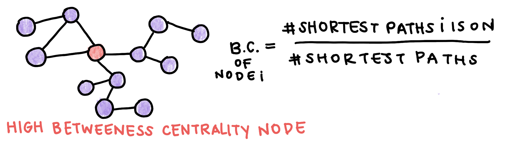
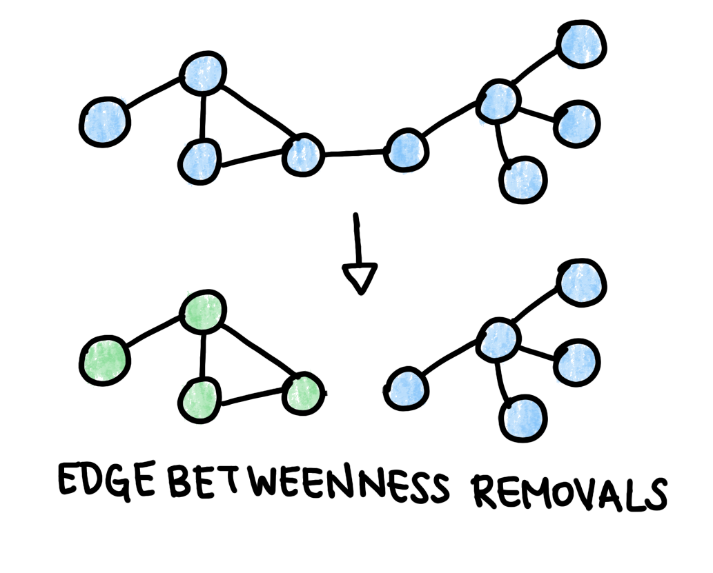

# Network Properties

For larger complex systems like the entire human genome, we may not want or be able to describe the mechanisms of interest. Instead, we can use experimental data to define model structure. One common model structure is a network, or graph. Often, complex systems are networks of simpler components. One example is the set of all interactions in the human proteome. Just like a genome is all the genes an organism has, the **proteome** is all the proteins an organism can express. The human proteome is not static: while there are around 20,000 genes, each gene can undergo alternative splicing to create multiple proteins. Proteins interact with each other to carry out most cellular processes. These protein-protein interactions can be represented mathematically using **protein-protein interaction networks** (PPI networks). Several databases store these interaction networks and update them based on experimental data. In this section, we will use [HIPPIE](http://cbdm-01.zdv.uni-mainz.de/~mschaefer/hippie/index.php) (Human Integrated Protein-Protein Interactome rEference).

One of the key uses of PPI networks is to identify new disease-related proteins in the human proteome. Once we construct a graph based on the PPI data, we can annotate it to hypothesize groups of related genes and predict which ones may cause a disease.

You can download the most recent HIPPIE database [here](http://cbdm-01.zdv.uni-mainz.de/~mschaefer/hippie/hippie_current.txt). It's formatted as a text file with columns for the two interactors and a confidence value assgined based on the number and quality of studies showing a particular interaction.

<center>

<sub><sup>*Table 1: Sample PPI data from HIPPIE. A interacts with B with a confidence score determined by the strength of literature support for the interaction.*</sup></sub>

| Interactor A   | Interactor B | Confidence Score |
| :---:        | :----:  |:----: |      ---: |
| NEB1     | ACTG | 0.73   |
| SRGN     | CD44|  0.65    |
|GRB7      |ERBB2  |0.9   |

</center>


We can build a graph using this data. Graphs are made up of edges and vertices. $V$, or the number of vertices, represents the number of components in the system (in this case, proteins). It is also known as the **size of the network**. $E$, or the number of edges, represents the number of interactions between components. Each edge can have a **weight**, or numeric value assigned to it. For the data above, the weights are the confidence scores given to each interaction. In addition, the interactions are directed from Interactor A to Interactor B. This kind of graph is called an edge-weighted directed graph, or **edge-weighted digraph**. 

<center>


<sub><sup>*Fig. 1: Graphs or networks form the basis of many models. Graphs can be directed and undirected and are composed of edges and vertices. Edges can be weighted or unweighted.*</sup></sub>

</center>

There are multiple packages that can construct graphs for you. Later, we will use one of these (networkX) for simplicity. To start, however, we can write a simple EdgeWeightedDigraph class in Python. The graph will be made up of directed edge objects in python. Each DirectedEdge goes from $v$ to $w$ and has a weight attribute.

```python
class DirectedEdge:
    def __init__(self, v, w, weight):
        self.v = v
        self.w = w
        self.weight = weight
    
    def toString(self):
        return '{} -> {}  {}'.format(v, w, weight)
```

The toString() method prints the edge with its weight so we can visualize the graph later on. The EdgeWeightedDigraph class stores edges as an **adjacency list**. An adjacency list is a list where each element represents the list of nodes connected to a node. For a node $v$, its corresponding element in the adjacency list is a list of edges between $v$ and $w_1, w_2...$, the nodes to which $v$ connects.

```python
class EdgeWeightedDigraph:
    def __init__(self, V):
        self.V = V
        self.E = 0
        self.graph = []
        for i in range(V):
            self.graph.append([])
    
    def addEdge(self, v, w, weight):
        self.graph[v].append(DirectedEdge(v, w, weight))
        self.E+=1
    
    def getEdges(self):
        for v in range(self.V):
            for e in self.graph[v]:
                print(e.toString())
```
We can initialize a new version of this graph and add some edges to it to test it out:
    
```python
ewdg = EdgeWeightedDigraph(3)
ewdg.addEdge(0, 1, 0.3)
ewdg.addEdge(0, 2, 0.9)
ewdg.addEdge(1, 2, 0.15)
ewdg.getEdges()
```

This should print: 

```python
0 -> 1  0.3
0 -> 2  0.9
1 -> 2  0.15
```

Another way to represent a graph is an **adjacency matrix**. An adjacency matrix is a square matrix whose elements represent if a pair of vertices are connected. In the case of a weighted graph, the adjacency matrix values are the edge weights. For the sample graph we created above, the adjacency matrix would look like this:

<center>


<sub><sup>*Fig. 2: Adjacency Matrices are another way of representing a graph. For an unweighted graph, the values of a matrix are binary (either 1 or 0). If a graph is weighted, the values are the weights themselves.*</sup></sub>

</center>

Moving forward, we'll be using the package [NetworkX](https://networkx.github.io/) to construct and analyze our graphs. We first read in our dataset and construct a list of edges from the DataFrame. Each edge is a tuple (a list that cannot be changed) of the two vertices it connects and its weight.

```python
import pandas as pd 
import networkx as nx
import matplotlib.pyplot as plt

data = pd.read_csv('cleaned_data.csv')
data.head()

edges = []
for i in range(len(data)):
    edge = (data.id_A[i], data.id_B[i], data.weight[i])
    edges.append(edge)
```

The DiGraph class starts out empty, then we add all the edges in the list we just made. 

```python
graph = nx.DiGraph()
graph.add_weighted_edges_from(edges)
```

NetworkX has a large variety of useful functions, including a function that creates an adjacency matrix for us:

```python
A = nx.adjacency_matrix(graph)
```

Protein-protein interaction networks have several key properties that we can exploit to predict new disease-related genes. The **degree** of a node is the number of edges incident on it. In directed networks, nodes have an in-degree and an out-degree. Nodes with a high degree are known as **hubs**, and multiple studies have shown that essential genes are associated with hubs. Disease-causing proteins tend not to be hubs, mostly because defects in essential proteins are fatal. 

Since we hypothesize that disease genes tend to be peripheral, we can look for other metrics of centrality to distinguish them. **Betweenness centrality** measures how much a node is on pathways between other nodes. Nodes with high betweenness centrality tend to be essential. Betweenness centrality is calculated as the proportion of shortest paths that go through a node. Note that algorithms to find the shortest path will not be covered here.

<center>



<sub><sup>*Fig. 3: Betweenness Centrality is a metric of how central a node is. It is calculated as the proportion of the shortest paths between all nodes in the graph that goe through a specific node.*</sup></sub>

</center>

For our graph, we can compute the degree and betweenness centrality of each node. To speed up the computation, we can consider only the shortest paths for the 50 nodes nearest each node in the graph. This code returns a dictionary where the keys are the node numbers and the values are the computed betweenness centralities.

```python
#Compute in and out degrees
degrees = graph.degree()

#Compute the betweenness centrality
betweenness_centralities = nx.betweenness_centrality(graph, 50)
```
Using these computations, we can rank the proteins in our dataset from most hub-like to most peripheral.

```python
#Create dataframe from 
bc_df = pd.DataFrame.from_dict(betweenness_centralities, orient='index', columns=['bc']).reset_index()
degrees_df = pd.DataFrame.from_dict(degrees, orient='index', columns=['degrees']).reset_index()

#Join with original dataframe
df = pd.merge(bc_df, degrees_df, on='index')
data['index'] = [str(data['Unnamed: 0'][i]) for i in range(len(data))]
merge = pd.merge(df, data, on='index', how='inner')

#Sort nodes by centrality and degree
sorted_by_centrality = merge.sort_values('bc', ascending=False)
sorted_by_degree = merge.sort_values('degrees', ascending=False)
```

The top 3 most hub-like nodes by degree are ESR2, TRIM25, and APP. The top 3 most hub-like nodes by betweenness centrality are PDZK1, APP, and ITGA4. ESR2 and TRIM25 are both transcription factors, which are proteins that interact with genes, as well as other transcription factors, to regulate transcription. By definition, these genes often have many protein-protein interactions because of their role in the cell.

Another hypothesis of network medicine is the **local hypothesis**, which states that proteins involved with the same disease tend to cluster in the same network neighborhood and interact with each other in a **disease module**. We can search the literature for a list of known disease-causing genes and use them to construct a disease module. We can then predict that nodes that are within the disease module are more likely to cause that disease, even if their function is not yet known.

Let's look at an example disease. Previous research into Alzheimer's has identified several genes associated with the disease. Using the database [here](http://cbdm-01.zdv.uni-mainz.de/~jfontain/cgi-bin/genes2diseases.pl), we can select a list of these genes.

```python
als_gene_list = ['APP','BACE1','PSEN1','MAPT','APOE','SNCA','PSEN2',
'C9orf72','BDNF','GRN','TARDBP','LRRK2','PRNP','PARK2','SORL1',
'CLU','GSK3B','NOTCH3','TOMM40','IDE','SOD1','PICALM','TREM2',
'CHAT','PINK1','CDK5','NCSTN','BCHE','CYP46A1','BACE2','DYRK1A',
'LRP1','HTT','A2M','COMT','APBB1','CALHM1','ITM2B','IL1A','VCP',
'PIN1','PARK7','CR1','CST3','CHRNA7','CTSD','ADAM10','FUS','ACE',
'IL1B']
```

To find potential disease modules related to Alzheimer's, we can perform an algorithm that repeatedly removes the edges with high **edge betwenness** from the graph. Edge betweenness is similar to betweenness centrality, except it is computed for a specific edge rather than a node. We would expect modules to have a few edges with high edge betweeness connecting one module to another. When we have completed this process, we will have a dendrogram (see the Clustering Graphs section). The module with the highest proportion of disease genes is hypothesized to be the disease module. We can make a list of the non-annotated nodes in the disease module and predict that these proteins may be disease-linked as well. We can further narrow down the list by computing the degree of these nodes and excluding hubs.


```python
def cluster_edge_betweenness(iterations, G):
    for i in range(iterations):
        eb = nx.edge_betweenness_centrality(G, 10)
        max_eb = max(eb, key=eb.get)
        G.remove_edge(max_eb[0], max_eb[1])
    return G

clustered_graph = cluster_edge_betweenness(num_iterations, graph)
```
<center>



<sub><sup>*Fig. 4: Betweenness removals remove the edge with the highest edge betweenness to form domains of the graph that may have a functional connection.*</sup></sub>

</center>

After clustering the graph by edge betweeness, we can compute the proportion of disease genes in each module. In the code below, we first count the number of connected components and their size using a built-in NetworkX function , then compute the proportion of disease genes in each module.

```python
#Find component for each disease gene and compute counts
count_ccs = np.zeros(len(size_ccs))
for i in range(len(als_gene_list)):
    als_gene = als_gene_list[i]
    als_gene_key = als_data.loc[als_data.A == als_gene].id_A.unique()
    if len(als_gene_key) != 0:
        cc = len(nx.node_connected_component(graph, als_gene_key[0]))
        for j in range(len(size_ccs)):
            if cc == size_ccs[j]:
                count_ccs[j] += 1

percent_disease_genes = 100*count_ccs/size_ccs

new_graph = cluster_edge_betweenness(100, new_graph)
```

This section offers only a brief introduction to network properties and annotating graphs. For further reading on network medicine, we recommend [this review](https://www.ncbi.nlm.nih.gov/pmc/articles/PMC3140052/) by Barabási et al. Another family of algorithms we can use to find functional similarity and relate genes and proteins are clustering algorithms, which will be covered [next](../clustering-graphs/clusteringgraphs.md).

