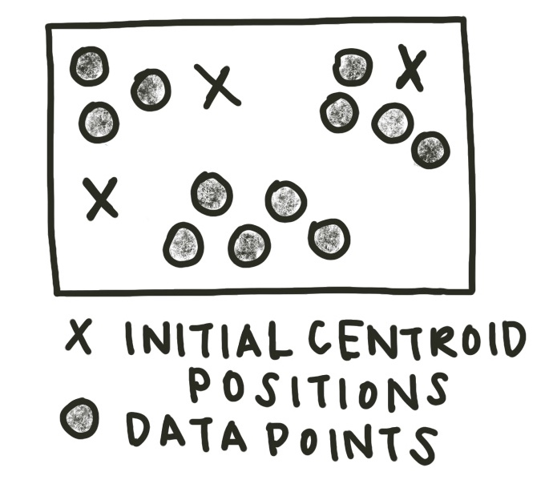
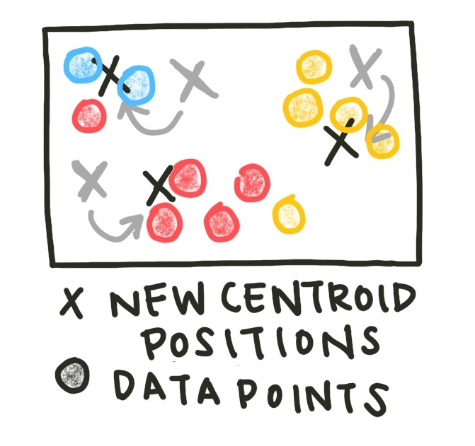
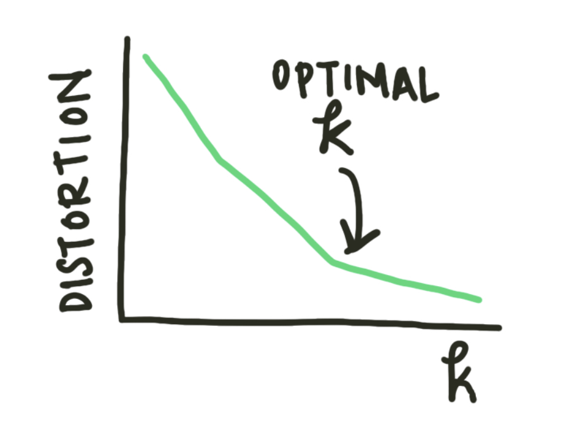

# Clustering Algorithms

In the last [section](../annotating-graphs/annotatinggraphs.md) we looked at networks and their properties. The data we used gave an explicit list of relationships, or edges, to create our network. But what happens if we have data on the features of a particular object set, but not information on how or how much those objects interact? How do we hypothesize functional similarity or interaction?

One common example of datasets of this type is **gene expression data**. We can obtain the relative amount a gene is expressed under different conditions using microarray hybridization experiments. We would expect genes with similar functions to be similarly expressed. Thus, if we cluster the features of the dataset, we may find modules of genes with mechanistic connections.

The sample dataset used in this section is yeast mitotic cell cycle data. A sample of the dataset is below. There are columns for the gene name (if known) and its relative expression levels at timepoints 0 to 160 minutes.

<center>

<sub><sup>*Table 1: gene expression data. Each column represents a time point. Each row is a gene and its relative expression levels.*</sup></sub>

| Gene Name   | *t* = 0 |  ...  | *t* = 160 |
| :---        | :----:  |:----: |      ---: |
| YDL025C     | -0.1725 |       | -0.3135   |
| YKL032C     | -0.2364 |       | 0.0751    |
|YJR150C      |-0.6929  |       |-0.7298    |

</center>

Often, experimental data must be preprocessed to remove noise, outliers, and normalize the features of interest. In this case, we remove the 10th and 11th time points as outliers based on information from the literature.

```python
import pandas as pd

#Read in gene interaction data
raw_data = pd.read_csv('yeast_gene_interactions.csv',sep='\t')

#Remove 90, 100 minute time point as outliers
raw_data = raw_data.drop(['t:90', 't:100'], axis=1)

```

We also remove genes with low average activity and low variability as not relevant to the environmental conditions of interest. 

```python
#Remove ORFs with low average 
raw_data['row_mean'] = raw_data.loc[: , "t:0":"t:160"].mean(axis=1)
cutoff = raw_data.row_mean.mean() - raw_data.row_mean.std()*2
cleaned_data = raw_data.loc[raw_data.row_mean > cutoff]

#remove ORFs with low variability
cleaned_data['row_std'] = cleaned_data.loc[: , "t:0":"t:160"].std(axis=1)
cutoff = cleaned_data.row_std.mean() - cleaned_data.row_std.std()*2
cleaned_data = cleaned_data.loc[cleaned_data.row_std > cutoff]
```

Finally, we normalize the gene expression vectors to have an average of 0 and a standard deviation of 1. Normalization adjusts values measured in different scales to a common scale, often centered at zero. To do this, we subtract the mean expression value for a gene from each of its expression data points and divide by its standard deviation

<center>


<sub><sup>*Fig. 1: Normalizing a distribution centers it around zero and sets the standard deviation to be 1. This allows for easier comparison of features with different original scales.*</sup></sub>

</center>

```python
#Normalize gene vectors 
normalized_data = cleaned_data
for i in range(len(cleaned_data)):
    gene_vector = cleaned_data.iloc[i]['t:0':'t:160']
    new_vector = (gene_vector - gene_vector.mean() ) / gene_vector.std()
    normalized_data.iloc[i] = new_vector
normalized_data['NAME'] = cleaned_data.NAME
normalized_data['YORF'] = cleaned_data.YORF
normalized_data['GWEIGHT'] = cleaned_data.GWEIGHT

```

There are a variety of clustering algorithms, but all of them rely on calculating how close individual data points are to each other. But what does distance mean in a high-dimensional space like our gene expression data? One common distance metric is the **Euclidean distance**. The Euclidean distance between two points in n-dimensional space is defined as 

 <center>

$distance(p, q) = \sqrt{(q_1 - p_1)^2 + (q_2 - p_2)^2 + ... + (q_n - p_n)^2}$
 
</center>

The most common method of clustering a graph is **k-means clustering**. K-means clustering requires the user to input the number of clusters expected, or k, as a parameter. Initially, k centroids are randomly created.



```python
centroid_positions = []
    for j in range(k):
        coordinates = []
        for i in data:
            r = random.uniform(data[i].min(), data[i].max())
            coordinates.append(r)
        centroid_positions.append(coordinates)
```

Each data point is assigned to the cluster of the closest centroid (using Euclidean distance). The sample assignment function is below.

```python
def assign(data, centroid_positions):
    cluster_assignments = []
    for i in range(len(data)):
        datapt = data.iloc[i]
        min_distance = 800000
        cluster_assignment = 0
        for j in range(len(centroid_positions)):
            euclidean_distance = math.sqrt(sum([(a - b) ** 2 for a, b in zip(centroid_positions[j], datapt)]))
            if euclidean_distance < min_distance:
                min_distance = euclidean_distance
                cluster_assignment = j
        cluster_assignments.append(cluster_assignment)
    return cluster_assignments

    cluster_assignments = assign(data, centroid_positions)
    data['closest'] = cluster_assignments
```

Now, the centroids of the assigned clusters are recalculated. 


```python
def update(data, centroid_positions, k):
    centroid_movements = []
    for j in range(k):
        datapt_centroid = data.loc[data.closest == j].reset_index(drop=True).loc[1:, 't:0':'t:160']
        new_coordinates = []
        for i in datapt_centroid:
            new_coordinate = datapt_centroid[i].mean()
            new_coordinates.append(new_coordinate)
        centroid_movement = [abs(a - b) for a, b in zip(centroid_positions[j], coord)]
        centroid_movements.append(centroid_movement)
        centroid_positions[j] = new_coordinates
    return centroid_movements, centroid_positions

centroid_movements, centroid_positions = update(data, centroid_positions, k)
```



This process - assign data to clusters, then update the cluster centroids - is repeated until the centroids no longer change location significantly. We can set our definition of 'significantly' by setting a tolerance value - how little the centroids would have to move before we consider them stable.

```python
iteration_count = 0
tolerance = 0.05
    while(max([max(centroid_movements[i]) for i in range(k)]) > tolerance):
        iteration_count+=1
        print('Iteration', iteration_count)
        cluster_assignments = assign(data, centroid_positions)
        data['closest'] = cluster_assignments
        centroid_movements, centroid_positions = update(data, centroid_positions, k)
        centroid_data.append(centroid_positions)
```


Often, however, we do not initially know how many clusters exist in our data. We can run the k-means clustering algorithm for a variety of k values and plot the average distance to the centroid of the cluster. This plot is known as an **elbow plot**. 

<center>



<sub><sup>*Fig. 2: An elbow plot diagram. When the rate of change of the distortion decreases (the 'elbow' of the plot), the optimal $k$ value has been reached.*</sup></sub>

</center>


Similar clustering methods to k-means use other metrics of centrality to determine centroid location (for example, the medoid) or use similarity measures rather than strict classification. 

Another class of methods is agglomerative clustering methods. These methods start with all data points in separate clusters and merge close clusters iteratively until all points are combined in a single cluster. 

<center>


<sub><sup>*Fig. 3: Agglomerative clustering methods start with each data point as an original cluster and combine clusters until the desired number of clusters has been reached or all data points are combined into one cluster.*</sup></sub>

</center>

Agglomerative methods do not assume an exact number of clusters. Instead, the results are displayed as a **dendrogram** and the analyst can select the appropriate number of agglomerative iterations to reach an optimal number of clusters.

<center>


<sub><sup>*Fig. 4: Dendrograms map the number of clusters over time. As the agglomerative clustering method iterates, the overall number of clusters reduces. Looking at these plots can help a scientist determine the optimal number of clusters.*</sup></sub>

</center>


We can now apply these two methods to our yeast cell cycle gene expression dataset. Since we don't know the optimal number of clusters, we ran our clustering algorithm with 4-16 clusters and plotted the elbow plot.

<center>


<sub><sup>*Fig. 5: The elbow plot from our k-means clustering algorithm.*</sup></sub>

</center>

Based on the elbow plot, the optimal number of clusters looks to be around 15. We can look at the best clusterings by projecting the data and cluster centroids into 2 dimensions using dimensionality reduction methods (in this case, LDA). 

<center>


<sub><sup>*Fig. 6: Plotting the clusters and our data in 2 dimensions requires dimensionality reduction. In this case we used LDA.*</sup></sub>

</center>

As you can see, the clusters separate regions of the dataset. We would hypothesize that genes in the same cluster are more likely to have related functions than genes in different clusters. This information can inform later biology experiments. As with other network models, clustering algorithms allow us to look at undifferentiated data and make inferences about potential functional relationships. However, these models do not provide a causal mechanism and thus must be paired with mechanistic experiments.