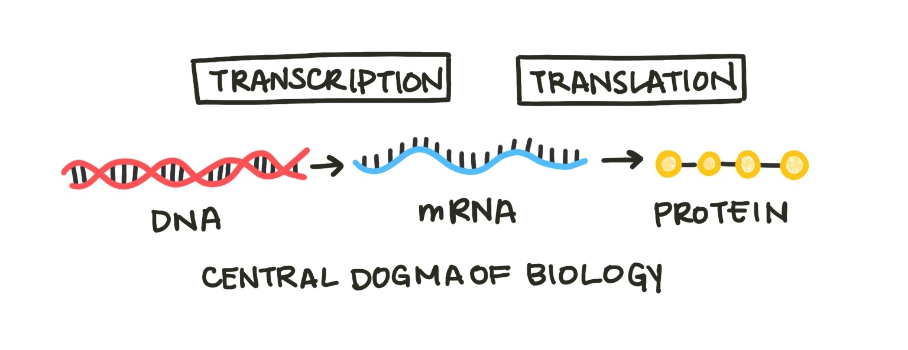

# Differential Equations

Often it is much easier to understand what makes a system change than to explain exactly what it will do. Think about a chemical reaction: we can tell by the reaction equation what process is occuring, but it is much more difficult to estimate by eye exactly how much that reaction will change the concentrations of reactants and products. For example, ethanol combusts to form carbon dioxide and water.

$reagents \rightarrow products$

$C_2 H_5 OH(l) + 3O_2 (g) \rightarrow 2CO_2(g) + 3H_2O(l)$ 

We understand the mechanisms that drive this system well. We know that the molecules of reactants will turn into molecules of products, and we have experimental kinetics data that measures how quickly this process occurs. Still, what if we scale up or down the reaction and want to know how the concentrations of reagents will change over time? In that case, a differential equation model can help us. **Differential equations** are equations that relates a function and one or more of its derivaties. They describe how a system changes.

Just like chemical reactions, we can model biological processes with differential equations. The central dogma of biology states that cells transcribe DNA into RNA and translate RNA into proteins.

A simple model of gene expression must include these three components. We will call them $G$, $T$, and $P$ for gene, transcript, and protein.

$\frac{\delta G}{\delta t} = 0$
 

No new genes are made in this model. Sure, cells eventually reproduce and synthesize new DNA, but we are excluding that from our system (for now).

$\frac{\delta T}{\delta t} = cG$
 

RNA is produced at a constant rate dependent on the number of genes that can produce it. C is a constant that scales this rate.

$\frac{\delta P}{\delta t} = kT$
 

Protein is produced from RNA. The more RNA in a cell, the more protein that can be produced (scaled by a constant K). 

Let’s examine how the concentrations of G, T, and P change over time. Try adjusting the constants K and C.

### Graph of evolution over time (interactive with sliders for K, C etc)

The amount of protein and mRNA in the cell grows infinitely large. This doesn’t make any physical sense - cells would explode with the amount of protein! We know that the reason cells must make more RNA and protein is because both degrade over time. Let’s add a degradation term to the model:

$\frac{\delta T}{\delta t} = cG - vT$

$\frac{\delta P}{\delta t} = kT - uP$

Now we can see that the amount of protein and transcript doesn’t grow forever but levels off at a constant level. 

### Graph of evolution over time (interactive with sliders for K, C etc)

Let’s add one more mechanism to our model. Often cells know to stop producing a certain protein using negative regulation. The protein produced by a certain gene can block that gene’s further transcription. Therefore, the more protein in a cell, the less the gene that makes it is transcribed, which keeps the levels of protein in a cell stable. This process is known as **autoregulation**.

$\frac{\delta G}{\delta t} = -dP$

You can repeat this process, adding new components and mechanisms to the model based on our existing physical understanding of the underlying mechanisms. Notice that as we added more mechanisms to the model, it grew more complex.

But what about gene regulation systems where multiple proteins or RNAs influence production of another protein? Or genes that produce multiple RNAs via alternative splicing? Or multiple genes modeled at once? What about the whole genome? Very quickly, by expanding the boundaries of our system, differential equation models become too complex to solve analytically. 

One way to reduce this complexity is to narrow the questions we are asking. If we don’t care about every moment in time but just where a system ends up - where it sits at equilibrium - we can focus on [equilibrium analysis](equilibriumanalysis.md) instead.

Another direction we can go is to focus less explicitly on the exact mechanisms of the system. Sometimes this is our only option - we don’t know the mechanism of the process we’re studying. These models assume less knowledge about the system we’re working on, and are driven primarily by data. 

# TO DO

- [x] Central dogma figure
- [x] Graph of evolution over time
- [x] Graph of evolution over time with autoregulation and decay
- [ ] Adjust parameters and units so makes sense relative to literature values
- [ ] Make interactive graph
- [ ] Write up section discussing overdaming and underdaming in system.

