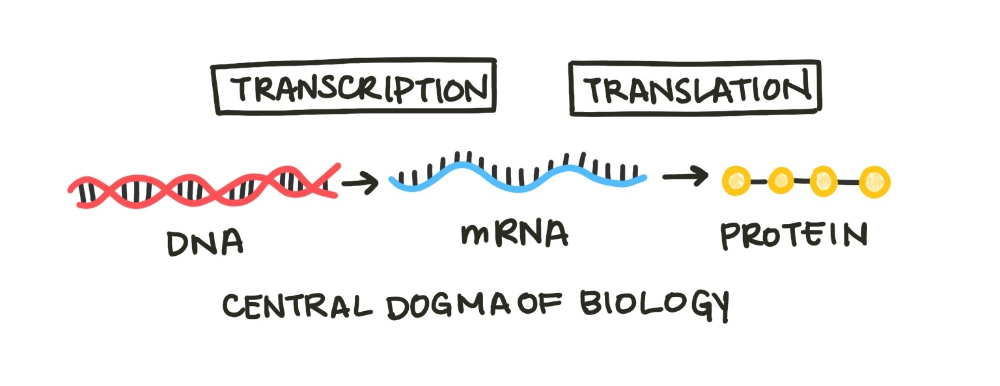
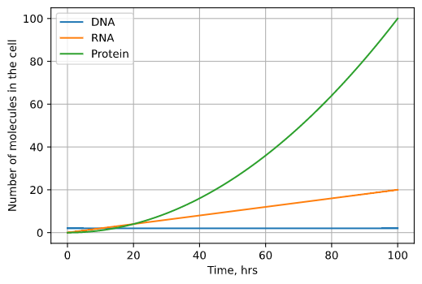
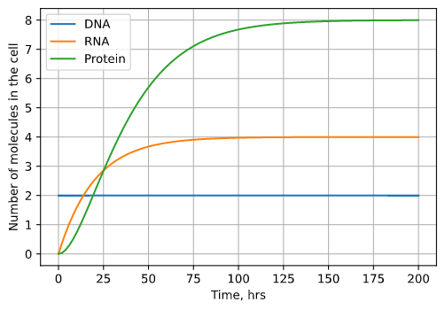
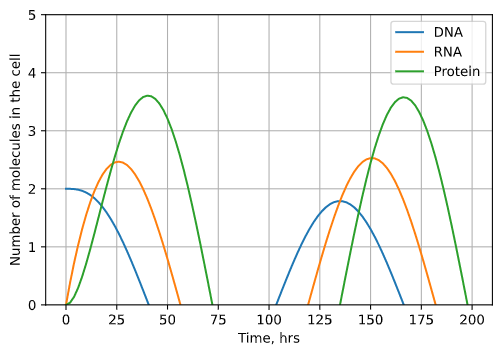

# Differential Equations

Often it is much easier to understand what makes a system change than to explain exactly what it will do. One xexample is a chemical reaction. Centuries of chemistry research have focused on describing chemical processes with stoichiometric equations. We can tell by the reaction equation which process is occuring, but it is more difficult to estimate by eye exactly how much that reaction will change the concentrations of reactants and products in a given container. For example, ethanol combusts to form carbon dioxide and water.

<center>

$reagents \rightarrow products$

$C_2 H_5 OH(l) + 3O_2 (g) \rightarrow 2CO_2(g) + 3H_2O(l)$ 

</center>

We understand the mechanisms that drive this system well. We know that the molecules of reactants will turn into molecules of products, and we have experimental kinetics data that measures how quickly this process occurs. Still, what if we scale up or down the reaction and want to know how the concentrations of reagents will change over time? In that case, a differential equation model can help us. **Differential equations** are equations that relates a function and one or more of its derivatives. Derivatives are the calculus version of rates - they describe how fast a quanitity is changing at one particular instant in time. Differential equations use derivatives to describe how a system changes.

Just like chemical reactions, we can model biological processes with differential equations. One elementary example woudl be the central dogma of biology, which states that cells transcribe DNA into RNA and translate RNA into proteins.

<center>



<sub><sup>*Fig. 1: The central dogma of biology describes the process by which the hereditary material, DNA, becomes protein, which makes up many cell components. The process of making RNA from DNA is called transcription, and the process of making protein from mRNA (messenger RNA) is translation.*</sup></sub>

</center>

A simple model of gene expression must include these three components. We will call them $G$, $T$, and $P$ for gene, transcript, and protein. Now we will state the assumptions of our model. Assumptions are the ground rules of the world we are building with our model. They often simplify the actual way things work in order to make modeling possible. Understanding our assumptions is important because they determine the uses and limitations of our model. First, we will assume that no new genes are made in the cell. Sure, cells eventually reproduce and synthesize new DNA, but this process occurs over a longer period of time (the generation time of the cell), so we are excluding that from our system (for now).

<center>

$\frac{\delta G}{\delta t} = 0$
 
</center>

Our next assumption is that RNA is produced at a constant rate dependent on the number of genes that can produce it. $c$ is a constant that scales this rate, determined from experimental data. 

<center>

$\frac{\delta T}{\delta t} = cG$
 
</center>

Protein is produced from RNA. The more RNA in a cell, the more protein that can be produced (scaled by a constant $k$). For each time step, we will assume all molecules of RNA in the cell can produce one protein.

<center>

$\frac{\delta P}{\delta t} = kT$
 
</center>

We can solve our differential equations using python. Solving a differential equation means finding functions for the evolution of the different variables over time. In this case, that would be $G(t)$, $P(t)$, and $T(t)$. We will use the odeint function from the scipy package, which requires a function that sets up our system of differential equations.

```python
from scipy.integrate import odeint

def get_concs(C, t):
    G, T, P = C
    dGdt = 0
    dTdt = c*G
    dPdt = k*T
    return [dGdt, dTdt, dPdt]
```

We create a list of times. If we want higher resolution, we include more granular time points. If we want a faster simulation, we include fewer. We integrate the differential equations for each time interval, which returns a list of molecule numbers over time. Differential equations also require an **initial condition**. In this case, this would be the initial number of molecules of DNA, RNA, and protein.

```python
import numpy as np

times = np.linspace(0., 100., 101)
ans = odeint(func=get_concs, y0=initial_concs, t=times)
Gs = ans[:, 0]
Ts = ans[:, 1]
Ps = ans[:, 2]
```

If we set reasonable values for C and K, we can plot how $G$, $P$, and $T$ change over time using the matplotlib package:

```python
import matplotlib.pyplot as plt

fig, ax = plt.subplots()
ax.plot(times, Gs, label='DNA')
ax.plot(times, Ts, label='RNA')
ax.plot(times, Ps, label='Protein')
ax.legend()
ax.set_xlabel('time, hrs')
ax.set_ylabel('Concentration, M')
plt.grid()
```

<center>



<sub><sup>*Fig. 2: The results of our basic model plotted over time. DNA stays constant with 2 copies, but the number of RNA and protein molecules both grow exponentially until infinitely large.*</sup></sub>

</center>

The amount of protein and mRNA in the cell grows infinitely large. This doesn’t make any physical sense - cells would explode with the amount of protein! We know that the reason cells must make more RNA and protein is because both degrade over time. Let’s add two degradation terms to the model, one for RNA and one for protein. Instead of being dependent on the number of molecules from the previous step (gene or transcript), the degradation rates are proportional to the amount of transcript or protein itself($v$ and $u$ are constants). Our hypothesized mechanism is that the more protein present in the cell, the more quickly enzymes that break down protein can find it, so the fast degradation will occur. 

<center>

$\frac{\delta T}{\delta t} = cG - vT$

$\frac{\delta P}{\delta t} = kT - uP$

</center>

Solving and plotting our updated system, we can see that the amount of protein and transcript doesn’t grow forever but levels off at a constant number of molecules. 

<center>



<sub><sup>*Fig. 3: The results of our model incorporating degradation plotted over time. DNA still stays constant with 2 copies, but DNA and RNA both grow until a steady state equilibrium is reached. At this equilibrium point (8 copies for protein, 4 copies for RNA), degradation and production are balanced.*</sup></sub>

</center>


Let’s add one more mechanism to our model. Often cells know to stop producing a certain protein using negative regulation. The protein produced by a certain gene can block that gene’s further transcription. Therefore, the more protein in a cell, the less the gene that makes it is transcribed, which keeps the levels of protein in a cell stable. This process is known as **autoregulation**.

<center>

$\frac{\delta G}{\delta t} = -dP$

</center>

<center>



<sub><sup>*Fig. 4: The results of our autoregulation model plotted over time. Depending on the amount of autoregulation, the amplitude of the oscillations in the number of molecules will either grow (underdamped) or shrink (underdamped). In the plot shown, the oscillations are perfectly damped and will remain the same size. Note that the number of DNA molecules doesn't represent degradation but rather inactivation by the protein product.*</sup></sub>

</center>


You can repeat this process, adding new components and mechanisms to the model based on our existing physical understanding of the underlying mechanisms. Notice that as we added more mechanisms to the model, it grew more complex.

But what about gene regulation systems where multiple proteins or RNAs influence production of another protein? Or genes that produce multiple RNAs via alternative splicing? Or multiple genes modeled at once? What about the whole genome? Very quickly, by expanding the boundaries of our system, differential equation models become too complex to design and solve quickly.

One way to reduce this complexity is to narrow the questions we are asking. If we don’t care about every moment in time but just where a system ends up - where it sits at equilibrium - we can focus on [equilibrium analysis](equilibriumanalysis.md) instead.

Another direction we can go is to focus less explicitly on the exact mechanisms of the system. Sometimes this is our only option - we don’t know the mechanism of the process we’re studying. These models assume less knowledge about the system we’re working on, and are driven primarily by data. We'll discuss models like these in lager sections.


