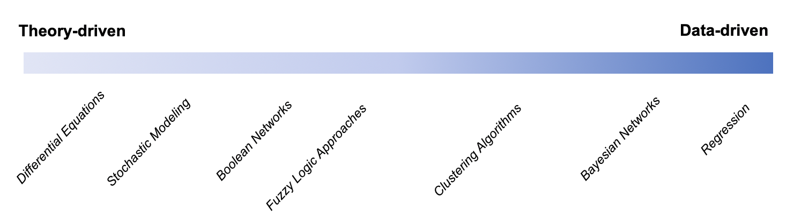

# Introduction

Systems are collections of things (from people to molecules) that are connected to produce a pattern of behavior. Often, we want to predict the future behavior of a system. We can do this using a variety of models. The types of models we'll be examining in this book fall along a spectrum from theory-driven to data-driven. Theory-driven models use a lot of existing knowledge about the world to make assumptions and create deterministic models. When we have less information about how exactly the system we are studying works, we can use other forms of data to build models that do not make as many mechanistic assumptions. 

We'll start off with differential equations, which describe how components change and are entirely deterministic. We'll progress to discussing equilibrium analysis, which is useful when we can't solve a complex system of equations analytically. We'll incorporate randomness with stochastic modeling, then move on to network models. Finally, we'll end with a discussion of regression. Most of the examples we'll use are drawn from biology, but there are wide applications of systems thinking. We highly recommend Donella Meadows' classic *Thinking in Systems*. 

We wrote this book for a younger version of ourselves - an undergraduate interested in modeling and sytems thinking, but unsure of the landscape of options and wanting a place to start. This project is meant to be a living text, growing as we learn more. We hope you forgive any elided information. If you have a correction or suggestion, please contact Charlotte [here](https://twitter.com/cjmerzbacher).