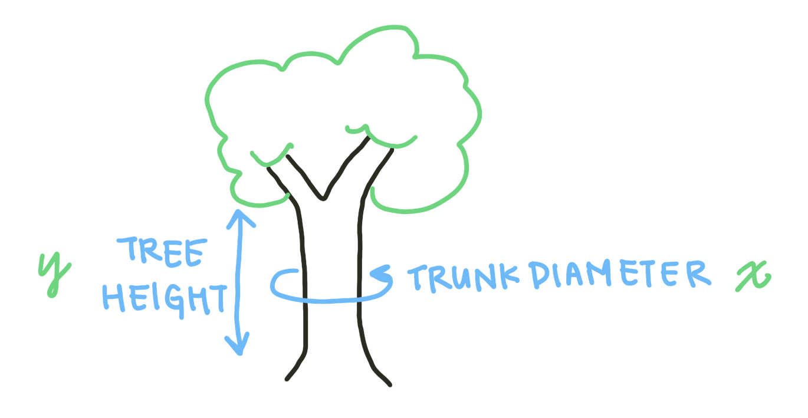
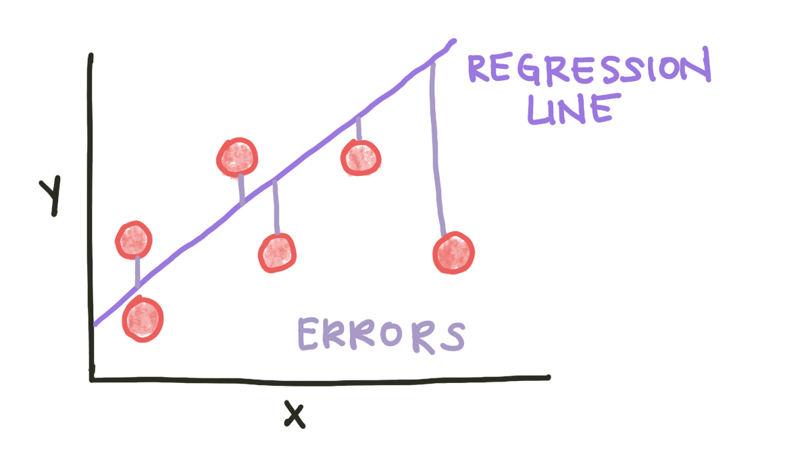
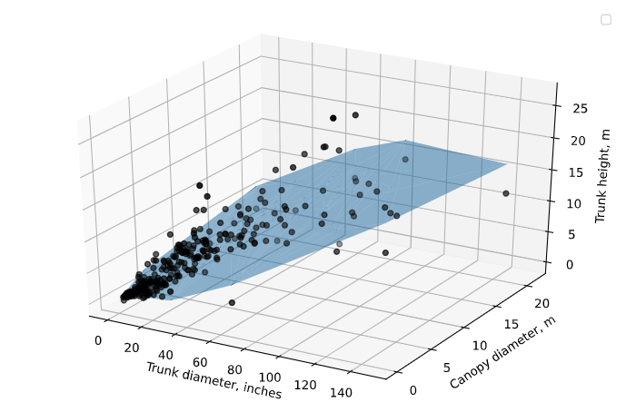

# Regression

How do we find and estimate the relationships between multiple variables in a large dataset? **Regression analysis** is a set of statistical methods that can relate a dependent variable with one or more independent variables. A **dependent variable** is the outcome variable we are trying to predict; **independent variables** are the predictor variables we are using in our model. A statistical model has the form:

<center>

$y = f(x_1, x_2, ... , x_n)$
 
</center>  

In a linear model, *f* is a linear combination of the dependent variables: 

<center>

$f = x_0 + c_1 x_1+ c_2 x_2 + ... + c_n x_n$
 
</center>  

For a linear model to work, the depdent variable must be continuous and the independent variables must be normally distributed. There's some wiggle room around these assumptions (how close to continuous/normal the data are), but linear models will misbehave if the data deviates from them.

We'll look at an example using only one variable (**univariate** regression) to start. For our dataset, we'll be using a LIDAR tree-sensing dataset from here (LINK). LIDAR measures the distance to a target using laser reflections. This dataset includes standardized observations of trees as well as the observed LIDAR height. We want to predict the actual height of the tree from its other characteristics, including the trunk diameter and crown diameter. To start with, let's see if trunk diameter predicts height.

The dependent variable here is tree height. The first independent variable we will consider is the trunk diameter.



After loading in and cleaning the data, we can perform a univariate linear regression using the LinearRegression() function from the scikit-learn module. We form arrays from the *stemheight* and *maxcanopydiam* columns of the dataframe and input them into the model.

```python
from sklearn.linear_model import LinearRegression

height = np.array(data.stemheight.reshape((-1, 1)))
canopydiam = np.array(data.maxcanopydiam).reshape((-1, 1))

model = LinearRegression()
model.fit(canopydiam, height)
```

**Fitting** a regression model involves minimizing an error parameter. In the case of linear regression, we minimize the **squared error** to the regression line:

<center>

$MSE = \frac{1}{N}\sum\limits_{i=1}^N (f_i - y_i)^2$
 
</center>  



The **$R^2$ coefficient** is one measure of how well a model predicts the data. Speficially, $R^2$, also known as the **coefficient of determination**, is the proportion of the variance in the dependent variable (in this case, tree height) that can be explained by the independent variable(s) considered in the model (in this case, canopy diameter). We can calculate the $R^2$ from our model like this: 

```python
R_sq = model.score(canopydiam, height)
```

Additionally, our goal with a regression model is to predict the dependent variable given a future data point's independent variables. We can calculate the predicted height of a tree if we were given the canopy diameters:

```python
pred_height = model.predict(canopydiam)
```

Finally, to visualize the model, we can plot the regression line using the predicted heights, as well as the original data: 

```python
fig, ax = plt.subplots(figsize = (9, 5))
plt.plot(data.maxcanopydiam, data.stemheight, 'k.', alpha=0.5, label='Data points')
plt.plot(canopydiam, pred_height, '-', label='Regression line')
plt.legend()
plt.grid()
ax.set_xlabel('Canopy diameter, m')
ax.set_ylabel('Trunk height, m')
```


What if we have multiple variables that might be linearly predictive of the dependent variable? We can use **multivariable regression**. In python, this looks quite similar to how we performed univariate linear regression, except we input an array of the desired independent variables.

```python
X = data[['maxcanopydiam', 'dbh']]
height = data['stemheight']
model = LinearRegression()
model.fit(X, height)
R_sq = model.score(X, height)
pred_height = model.predict(X)
```

If we want to visualize multivariate regression, we will either need *n* 2D graphs, where *n* is the number of independent variables, or a single *n+1*-dimensional plot. Since we have 2 independent variables, we can plot a 3D graph that visualizes the relationship between all three variables and the model. Note that in 2 dimensions, the predicted heights do not form a perfect line - this is because the other variables not visualized on the plot also affect the predicted value.




Overall, looking at our results, we can see that both the DBH, which is the diameter at branch height, as well as the canopy diameter, predict tree height. A larger trunk and canopy predict a taller tree. Based on common knowledge about trees, this conclusion makes sense. However, some linear regression analyses can uncover relationships that are less obvious. It is important to remember that regression detects **correlation** between two variables, not **causation**. Correlation is when two variables are associated with each other. Causation is when a change in the independent variable actually affects the dependent variable. While regression analysis can provide a useful starting point for further analysis, or confirm relationships already linked mechanistically, it cannot detect a causal link between two variables.