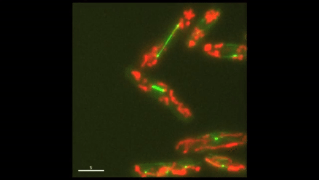
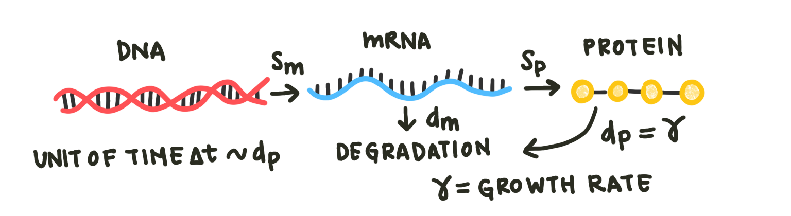
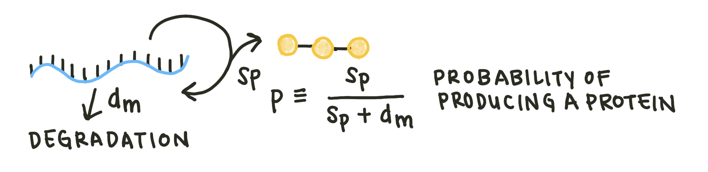
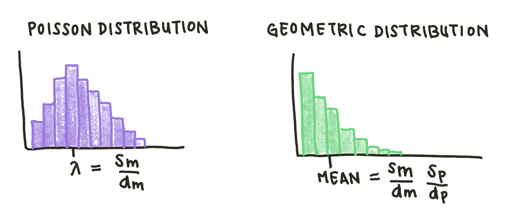
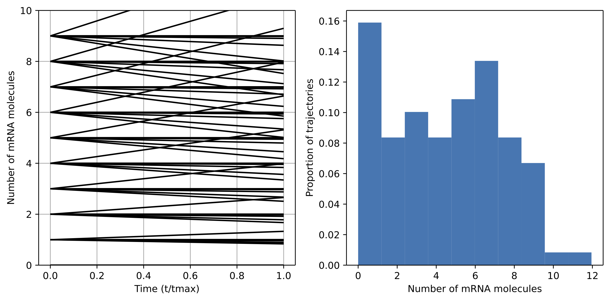
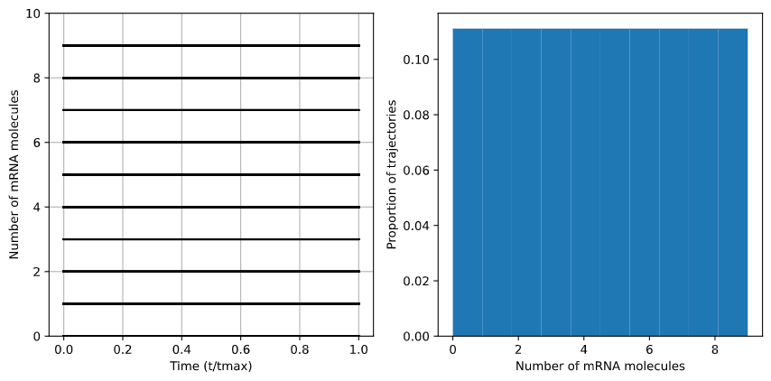
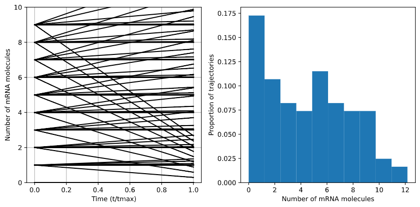

# Stochastic Modeling

One of the important assumptions of the differential equation models considered previously is a continuous distribution of the proteins or molecules of interest. In reality, cells contain only a finite (and usually quite small) number of a particular molecule. In some cases, we do not care to model individual cells: we may be able to consider a population of cells as a single unit, for instance in the case of a bulk bioreactor. However, for other applications we may want to examine gene expression in individual cells. Single-cell analysis is a growing family of techniques that allows scientists to study heterogeneous populations of cells and understand complex intercellular dynamics. 



To more adequately describe these **low-copy number dynamics**, we will use stochastic modeling. The system is quite similar to the one considered in the differential equations section [here](../differential-equations/differentialequations.md):



However, instead of using deterministic equations, we will model the probability of making a protein or mRNA molecule. The number of mRNA per cell cycle is distributed in a Poisson distribution, like many biological phenomena: 

<center>

$p(N) = \frac{\lambda^n}{n!}e^{-\lambda}$
 
</center> 

A Poisson distribution is a distribution that models the number of events occuring within a given time interval (in this case, the length of a single cell cycle). $\lambda$ is the shape parameter, which indicates the average number of events in the time interval.

The mean number of proteins, on the other hand, is dependent on the number of mRNA molecules. For each time step, the mRNA molecule can either degrade or replicate into a protein:



Given a probability that an mRNA produces a protein $p$, the probability of producing 0, 1, 2, or N proteins is:

<center>

$P(0) = 1 - p$
$P(1) = p(1 - p)$
$P(2) = p^2(1 - p)$
$P(N) = p^N(1 - p)$
 
</center> 

This mechanism results in a geometric distribution. Note that the mean number of proteins is actually not the most likely number in the cell.



It's important to note that while the number of protein/mRNA molecules in a cell is random, the *distribution* of these molecules is not. Therefore, we will model the deterministic way these probability distributions evolve over time in our model. To find the steady-state distributions, we will use the **Master equation**. Each state (number of molecules) is modeled with a separate deterministic equation. Examining the case of $n$ mRNA molecules:

<center>

$m_{n-1} \xrightleftharpoons[g_{n}]{f_{n-1}} m_n \xrightleftharpoons[g_{n+1}]{f_n} m_{n+1}$

$ \frac{\delta P(m_n)}{\delta t} = f_{n-1}m_{n-1} + g_{n+1}m_{n+1} - (f_n + g_n) m$

</center> 

For the simple model we established, the only components of $f$ and $g$ are constant degradation and production. Therefore, $f_n$ is just $S_m$ and $g_m$ is $d_{m} n$. The number of mRNA in a cell $m_n$ is a Poisson distribution:

<center>

$m_n = \frac{S_m}{d_m}\frac{1}{n!}m_o \approx \frac{\lambda^n}{n!}e^{-\lambda}$
 
</center> 

We can make similar equations for the protein distribution; however, we use a geometric distribution rather than a Poisson distribution.

A more complex model includes both mRNA and protein states. If $m$ is the number of mRNA and $n$ is the number of proteins, the possible states can be shown as a 2-dimensional matrix:

## Figure with equations including both

From the Master equation, we will have an infinite set of differential equations. To solve these equations, we can run simulations with many mRNA and protein initial conditions and plot the trajectories. Examining our simple model, we can build a Master Equation simulator in Python. First, we write functions to describe $m_n$, $g$, and $P(m_n)$. The functions for $m_n$ and $g$ take the current number of mRNA molecules in the cell and return the function value. 

```python
def get_m(n, mo):
    mn = mo*Sm/dm*(1/np.math.factorial(n))
    return mn

def get_g(n):
    return n*dm
```

The function to get $\delta P(m_n)/\delta t$ will eventually be integrated to get the function $P(m_n)$, so it takes the previous values of $P$, a time vector, and two parameters: the initial number of mRNA molecules for the simulation ($m_o$) and the current number $n$.

```python
def get_P(Ps, t, n, mo):
    P = Ps
    f = Sm
    if n == 0:
        dPdt = get_g(n+1)*get_m(n+1, mo) - get_m(n, mo)*(get_g(n)+f)
    else:
        dPdt = f*get_m(n-1, mo) + get_g(n+1)*get_m(n+1, mo) - get_m(n, mo)*(get_g(n)+f)
    return [dPdt]
```
To visualize multiple possible scenarios, we will want to vary the degradation and production parameters. Rather than changing the two parameters individually, we can vary their ratio, in this case $\frac{S_m}{d_m}$. In addition, we can set the maximum number of mRNA molecules to consider. Since most genes only express a limited number of mRNA molecules, this constraint is biologically accurate and speeds up computation.

```python
Smdm = 0.01
Sm = Smdm*1
dm = 1/Smdm
max_n = 10 #maximum number of mRNA molecules to simulate having
n = np.arange(max_n) #range of starting mRNA values
g = [get_g(i) for i in n] #range of starting g values
times = np.linspace(0., 1., 101)
```
We now iterate through a number of initial numbers of mRNAs and integrate the get_P() function for each condition. We can then plot the results of these functions to see the trajectories.

```python
Ps = []
for mo in np.arange(0., max_n, 1.): #iterate on mo
    for i in n:
        m = [get_m(i,mo) for i in n]
        ans = odeint(func=get_P, y0=[mo], t=times, args=(i,mo))
        Ps.append(ans[:, 0])

fig, (ax1, ax2) = plt.subplots(1, 2, figsize=(9, 4.5), tight_layout=True)
for i in np.arange(0, len(Ps), 1):
    ax1.plot(times, Ps[i], color='k')
ax1.set_xlabel('Time (t/tmax)')
ax1.set_ylabel('Number of mRNA molecules')
ax1.set_ylim([0, 10])
ax1.grid()
```

In addition to plotting the raw trajectories, we will want to plot a histogram of the final trajectory positions, which will give us the distribution of mRNA values. 

```python
#Pull final values for histogram construction
hist = [P[-1] for P in Ps]
ax2.hist(hist, bins=max_n, density=True)
ax2.set_xlabel('Number of mRNA molecules')
ax2.set_ylabel('Proportion of trajectories')
```

We ran the simulation for $\frac{S_m}{d_m}$ values of 0.75, 1, and 1.25. When the value of $\frac{S_m}{d_m}$ is below one, production occurs faster than degradation so the overall number of mRNA molecules increases and the distribution shifts upward. 



At $\frac{S_m}{d_m} = 1, degradation and production rates are perfectly balanced, so the distribution of mRNA molecules remains the same - in this case, perfectly uniform.



In the case of $\frac{S_m}{d_m} = 1.25$, degradation is faster than production, so the overal distribution shifts downward.



In this case, the number of possible initial conditions was small and the model complexity low, so the computational time was not an issue. However, as models incorporate more parameters, the naive protocol used above will start to take a long time. Instead, we can use the **Gillespie algorithm** to speed it up. The Gillespie algorithm has five steps:

1. Write out all possible reactions occuring in the model.
2. Randomly sample the exponential probability distribution of possible reactions for a single time step
3. Determine based on the probabilities which reaction was most likely. That reaction occured.
4. Reinitialize the concentrations and reaction probabilities with the new state
5. Iterate steps 2-4 until time t.

More information on the Gillespie algorithm can be found here {LINK TO PAPER}.

## Works Cited
https://www.youtube.com/watch?v=rBYYpPisjEs&ab_channel=OkinawaInstituteofScienceandTechnologyGraduateUniversity%28OIST%29